<!-- Header -->

  

  

  
  
  
  

  
  
  

  

<!-- About -->
<h2 align="center">About Me</h2>

<table align="center" width="100%">
  <tr>
    <td valign="top" width="55%">
      
Full-stack <strong>Software Developer</strong> at <strong>Orbitz IT Solution</strong>, building production web and mobile applications end to end — from Django REST APIs and database design to React front-ends and deployment.

      
Previously shipped client projects as a <strong>Freelancer</strong>, which taught me to scope, build, and deliver independently. I care about clean architecture, fast UIs, and code that's easy to maintain.

      
Currently working on business systems like <strong>billing, CRM, and pharmacy/lab management platforms</strong>.

    </td>
    <td valign="top" width="45%">
      <ul>
        <li>🔭 <strong>Current:</strong> Software Developer @ Orbitz IT Solution</li>
        <li>💼 <strong>Past:</strong> Freelance Software Developer</li>
        <li>🎓 <strong>Education:</strong> B.Tech in IT @ MVIT (8.23 CGPA)</li>
        <li>🏆 <strong>Achievement:</strong> Winner, Capgemini Tech 4 Positive Futures Challenge 2024</li>
        <li>🌱 <strong>Learning:</strong> System design, Next.js, cloud deployment</li>
        <li>💬 <strong>Ask me about:</strong> Django, React, REST APIs</li>
      </ul>
    </td>
  </tr>
</table>

  

<!-- Tech Stack -->
<h2 align="center">Tech Stack</h2>

<strong>Languages</strong>

  

<strong>Frontend</strong>

  

  React Native • React Query • React Router • React Hook Form • Chart.js

<strong>Backend</strong>

  

  Django REST Framework • JWT Auth • RESTful API Design

<strong>Databases</strong>

  

<strong>Cloud & DevOps</strong>

  

<strong>Tools</strong>

  

  

  

<!-- Analytics -->
<h2 align="center">GitHub Analytics</h2>

  

  
  

<strong>Contribution Graph</strong>

  

  

<!-- Quote -->

  <em>"The best way to predict the future is to implement it."</em> 
  — David Heinemeier Hansson

<!-- Footer -->

  

